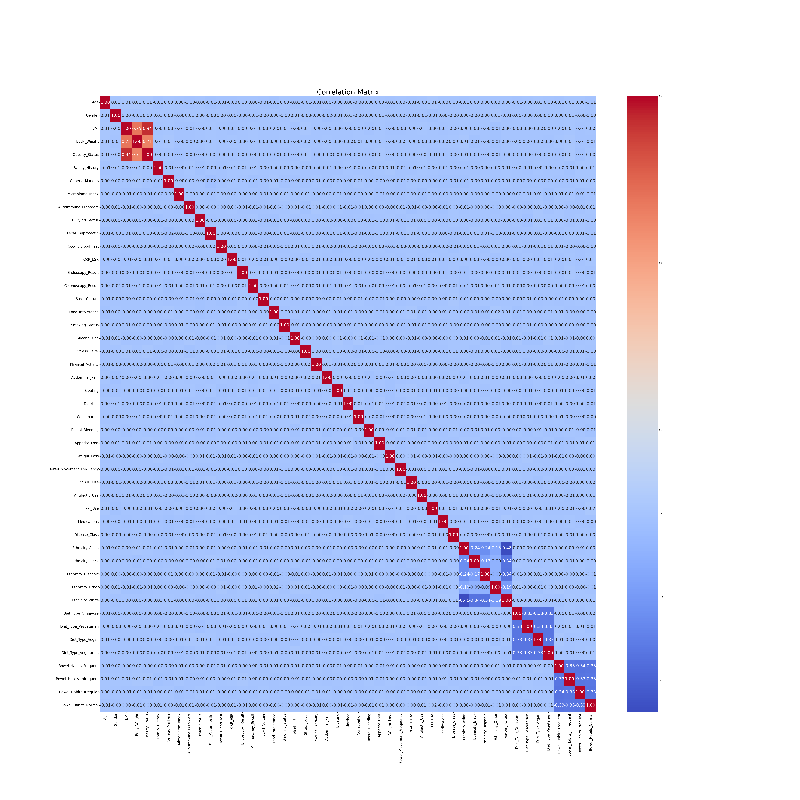
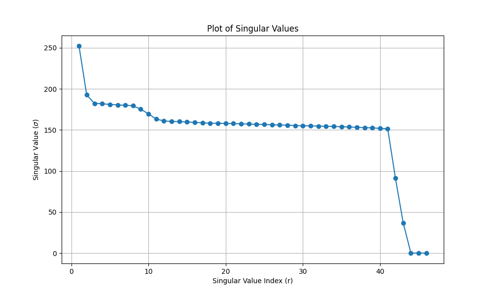
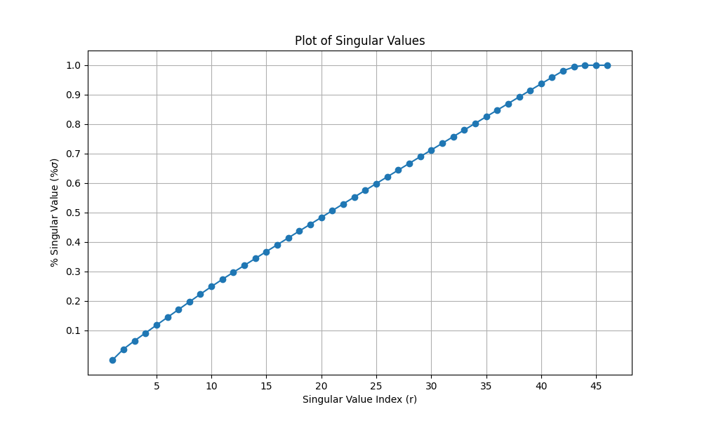
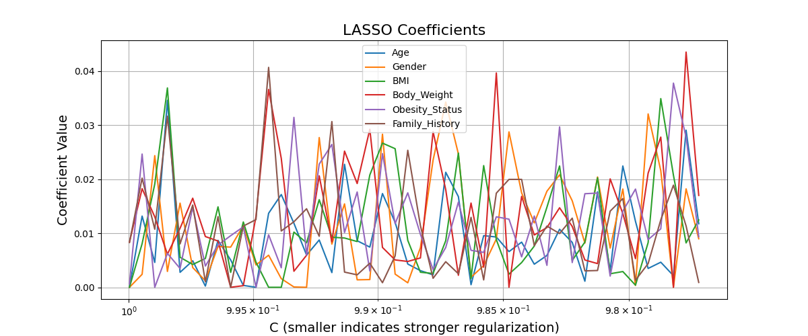
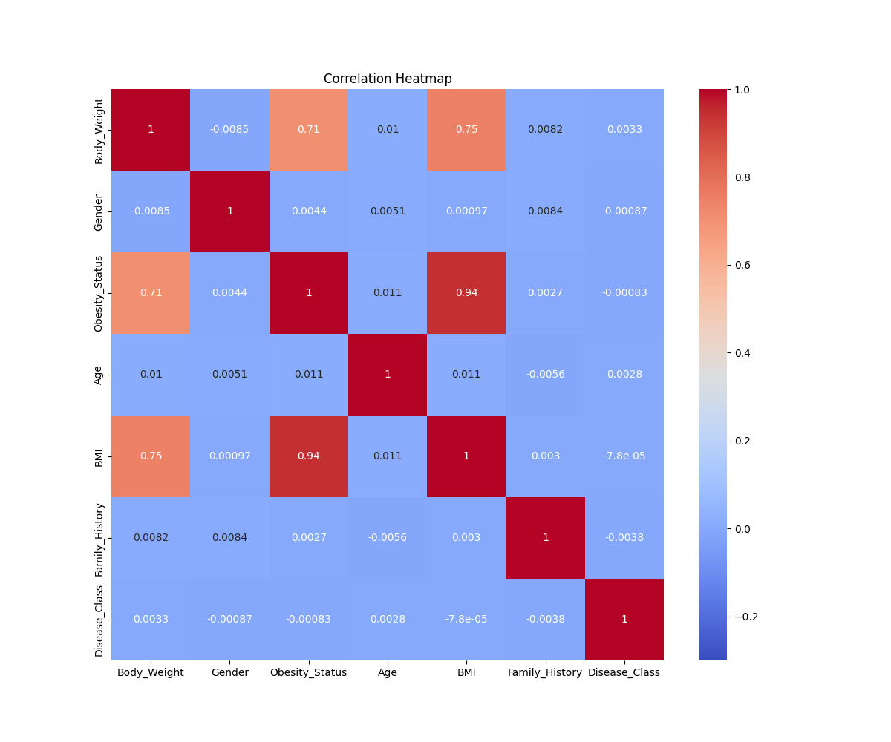
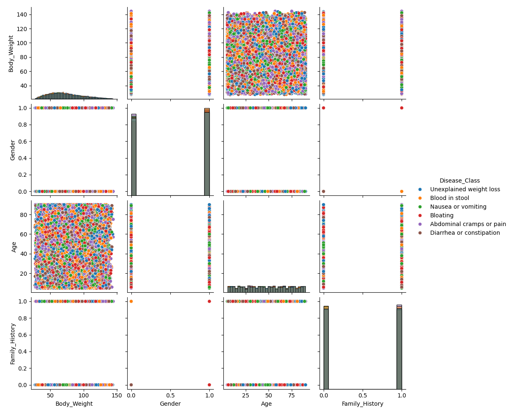
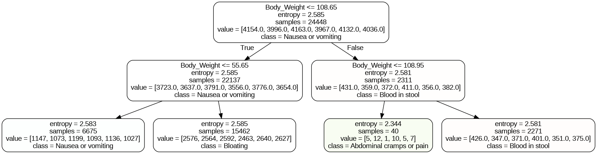

# Gastrointestinal Disease Dataset Analysis

## Introduction

A Kaggle dataset of medical data with a target of gastrointestinal disease states was downloaded from https://www.kaggle.com/datasets/amanik000/gastrointestinal-disease-dataset . The goal was to use AI to predict the disease state (target) based on the medical data (features). Unfortunately, the disease state target was replaced by random symptoms. The original dataset had 4 target categories: Crohn’s Disease, Ulcerative Colitis, IBS, and Healthy. The dataset posted on Kaggle has 6 target categories: Abdominal cramps or pain, Blood in stool, Nausea or vomiting, Unexplained weight loss, Diarrhea or constipation, and Bloating. This may have been done for legal reasons to prevent the dataset from being used for diagnostic purposes. 
The reasons the dataset appears to have been altered are as follows:
1.	There are 4 categories in the dataset description on Kaggle while there are 6 number in the actual dataset. 
2.	The target values are not as described.
3.	The target values are symptoms not diagnoses.
4.	When the feature data are clustered there are 4 clusters not 6. 
5.	The highest accuracy between prediction from any model and the target values is random at 0.17 (1/6 target classes = 0.17). This is true whether all the features are used to build a model or just the most relevant features.
## The Data
#### Demographic and Physical Attributes
**Age**: Age of the individual (in years).

**Gender**: Biological gender of the individual (Male/Female/Other).

**BMI**: Body Mass Index – a measure of body fat based on height and weight.

**Body_Weight**: Weight of the individual (in kilograms or pounds).
#### Health and Obesity Indicators
**Obesity_Status**: Classification of individual as Obese, Overweight, or Normal based on BMI and other factors.

**Ethnicity**: Ethnic background (e.g., Caucasian, Asian, African American, etc.).

**Family_History**: Indicates whether there is a family history of related diseases (Yes/No).
#### Biological and Genetic Markers
**Genetic_Markers**: Presence of known genetic markers associated with disease risk.

**Microbiome_Index**: Quantitative index representing the state of the individual's gut microbiome.
#### Autoimmune and Inflammatory Indicators
**Autoimmune_Disorders**: Indicates the presence of known autoimmune disorders (Yes/No).

**H_Pylori_Status**: Status of Helicobacter pylori infection (Positive/Negative).

**Fecal_Calprotectin**: Inflammatory marker found in stool; high levels may indicate IBD.

**Occult_Blood_Test**: Results of fecal occult blood testing (Positive/Negative).

**CRP_ESR**: Combined result of C-Reactive Protein and Erythrocyte Sedimentation Rate – inflammation indicators.
#### Diagnostic Results
**Endoscopy_Result**: Findings from endoscopy (e.g., Normal, Inflammation, Ulcers).

**Colonoscopy_Result**: Findings from colonoscopy (e.g., Polyps, IBD, Normal).

**Stool_Culture**: Results indicating presence of bacterial, viral, or parasitic infections.
#### Lifestyle and Diet
**Diet_Type**: Type of diet followed (e.g., Vegetarian, Vegan, Omnivore).

**Food_Intolerance**: Known food intolerances (e.g., Lactose, Gluten).

**Smoking_Status**: Current smoking behavior (Smoker/Non-Smoker/Former Smoker).

**Alcohol_Use**: Frequency or status of alcohol consumption.
#### Mental and Physical Health
**Stress_Level**: Self-reported stress level (Low/Moderate/High).

**Physical_Activity**: Level of physical activity (Sedentary/Moderate/Active).
#### Symptoms and GI Issues
**Abdominal_Pain**: Presence of abdominal pain (Yes/No).

**Bloating**: Whether the individual experiences bloating (Yes/No).

**Diarrhoea**: Presence of diarrhea symptoms (Yes/No).

**Constipation**: Presence of constipation symptoms (Yes/No).

**Rectal_Bleeding**: Observation of rectal bleeding (Yes/No).

**Appetite_Loss**: Decreased appetite (Yes/No).

**Weight_Loss**: Unintentional weight loss (Yes/No).

**Bowel_Habits**: Summary or description of bowel movement characteristics.

**Bowel_Movement_Frequency**: Frequency of bowel movements (per day/week).
#### Medication Usage
**NSAID_Use**: Use of Non-Steroidal Anti-Inflammatory Drugs (Yes/No).

**Antibiotic_Use**: Recent use of antibiotics (Yes/No).

**PPI_Use**: Use of Proton Pump Inhibitors (Yes/No).

**Medications**: Other medications currently being taken.
#### Target Variable
**Disease_Class**: Final diagnosis or disease classification (e.g., Crohn’s Disease, Ulcerative Colitis, IBS, Healthy). 
The actual categories in the dataset are Abdominal cramps or pain, Blood in stool, Nausea or vomiting, Unexplained weight loss, Diarrhea or constipation, Bloating.

## Approach Taken
### Data cleaning
The data were checked for duplicate rows and missing data. Neither were found. The data were very clean. Next the features and target were checked to understand if they were categorical or continuous. The target was categorical. Eleven of the features were continuous with the remaining 25 categorical for a total of 36 features. 
The target categories were found to be balanced ranging from 4965 to 5243 entries. The data were not further balanced.
The text features were converted to numeric values. Ethnicity, Diet_Type, and Bowel_Habits were one-hot encoded. Obesity_Status and Gender were assigned values. Where practical, the features were converted to int8 to reduce memory usage. The target was converted to numeric values using label encoding to allow the original text to be displayed when needed.

At this point there were 47 features and 1 target with 6 categories. 
### Data Analysis
A correlation matrix was calculated. Note that the highest correlation with the target was only 0.01. Some of the features had high correlations with each other. These were culled later by LASSO and the correlation values. 

 
The data were split into the features (X) and target (y) and then into training and test sets. 
### Principal Component Analysis
Singular value decomposition indicates that 34 of the 47 projected features contain 80% of the signal in the data. Unfortunately, as will be seen, 80% of noise is still noise. 
 
The elbows in the singular value plot below indicate there are about 3 main components, 8 important components, and 42 additional components depending on the percent Singular Value chosen as a cutoff.
 

## Feature Engineering
LASSO was employed to simplify the models to the most important features. The feature data were scaled and the best lambda (c) was determined. The c value was bracketed for logistic regression and plotted. The output shows noise. However, the algorithm did pick 6 features. These are shown in the legend and are used to make all the future models. Note that running the analyses with all the features produced similar results which will not be shown.

Because some of the features are closely related (BMI, Body_Weight, and Obesity_Status) a correlation matrix was calculated.

 
BMI was dropped because it has a correlation of 0.94 with Obesity_Status, 0.75 with Body Weight and only -0.000078 with the target. Obesity_Status was also dropped because it has a correlation of 0.75 with Body_Weight and only .00083 with the target. Body_Weight was kept because it has the best correlation coefficient of with the target at 0.0033.
It can also be seen visually from the pairplot that the signal is very weak or non-existent. 

 
A subset of the data consisting of the top 4 features and the disease class target was split into features and target and then into training and test sets.
## Classification
Several classification algorithms were tried including nearest neighbors, decision trees, random forest, boosting, naïve Bayes, and neural networks. 
### KNN
The K Nearest Neighbors (KNN) algorithm was tried but was too CPU intensive to tune for ersatz science. One cycle takes about 0.09 seconds. There are 30,560 rows and 4 feature columns. Training takes hours. Note that one cycle of KNN with n_neighbors = 3 produced the highest accuracy score of any of the models at 0.1741. However, this is random (0.1667) and may indicate some overfitting.
### Decision Trees
Four different grid search algorithms were tried before tuning the decision tree hyperparameters. HalvingRandomSearchCV produced the best results. However, the random aspect of this algorithm produces variable results. GridSearchCV was used for the final tuning. A tree graph of the results shows only 3 of the 4 or 6 target categories. Adding depth does not discriminate among the categories in any meaningful way. Already the number of samples is small for “Nausea or vomiting.” While adding more splits (depth) does not break the 10,000+ samples in two of the categories into around 5,000 as expected. This behavior would be expected if the target classes were assigned randomly.

 
### Random Forest
For random forest the max_features hyperparameter was tuned with the number of estimators held at 100 to keep the runtime to a minimum. The optimal max_features was 1. When the estimators were set to 1000 the accuracy was 0.1711. The estimators could be tuned further but probably will not improve the accuracy significantly. The accuracy at 100 estimators was 0.1724. The Out-of-Bag score was 0.1691.
### Boosting
Boosting or boot strapping is an ensemble method that sequentially trains models focusing on the mistakes of the previous models. The hyperparameters were tuned manually. It did not matter if the number of target classes (num_class) were 4 or 6. The best accuracy score was 0.1700.
### Naïve Bayes
Naïve Bayes predicts the probability of each category in the target based on each feature. The features most relevant for predicting the disease state are Family History and Gender. The accuracy is still too low to be useful at 0.1672.
Probability of Features Predicting Classes by Naïve Bayes

| Body_Weight |	Gender	Age	| Family_History |
|:-----------:|:----------:|:--------------:|
|-0.507289	|-5.461731	|-0.943103	|-5.470209|
|-0.507886	|-5.416463	|-0.942603	|-5.477791|
|-0.515287	|-5.430038	|-0.930984	|-5.491315|
|-0.511433	|-5.406763	|-0.937103	|-5.492682|
|-0.510909	|-5.454801	|-0.937270	|-5.501993|
|-0.504637	|-5.455063	|-0.947108	|-5.487135|

### Neural networks
A model was created using standard parameters (optimizer='adam', neurons=4, activation='relu', input_dim=4). Tuning was done for each parameter individually to reduce the time needed to run the code. The optimal hyperparameters were a batch size of 2, with 4 epochs, and 4 neurons. Additional layers were added sequentially but did not improve the validation accuracy beyond 0.1585. 
### Classification comparison
The statistics for all the classification algorithms are shown in the table below. Recalling that a random accuracy score would be 1/6 = 0.1667, it is clear there is no signal in these data.
| Algorithm	| Accuracy |	Precision |	Recall |	F1|
|:---:|:---:|:---:|:---:|:---:|
|KNN	|0.174084	|0.167347	|0.174084	|0.157847|
|Decision Tree	|0.170812	|0.086018	|0.170812	|0.108072|
|Random Forest |0.172448	|0.172856	|0.172448	|0.172514|
|Boosting	|0.169993	|0.170260	|0.169993	|0.169957|
|Naive Bayes	|0.167212	|0.175197	|0.167212	|0.105742|
|Neural Network	|0.169339	|0.028676	|0.169339	|0.049046|

## Clustering
To understand why the data are not classified as expected, clustering was done using Kmeans and DBSCAN. 
### Kmeans
The full set of features, X, were clustered using Kmeans in a range of 2 to 11 clusters. For readability the inertias were divided by 106 and plotted against the number of clusters as shown below. It appeared there were 4 clusters rather than the expected 6. This was another indication that there might be problems with the dataset. 
 
### DBSCAN
DBSCAN has the advantage of being more tolerant of noise than Kmeans. To further understand these results, DBSCAN was run with several epsilon and minimum samples settings. DBSCAN epsilon and minimum samples were tuned until 4, 5, and 6 clusters were found. One could argue that 4 clusters is best because there are fewer noise points. Finer tuning could be done but probably would not clarify the number of clusters or number of categories in the target.
Epsilon	Minimum Samples	Clusters	Noise Points
18.0	7	4	474
19.0	10	5	523
18.3	8	6	523

## Conclusion
The highest accuracy matching the features with the target was 0.17 obtained using KNN. On a scale of 0 to 1 with 6 balanced target categories, 0.17 is noise (1/6 categories = 0.17). There is no signal to allow diagnosis of disease class in the dataset. As enumerated in the introduction, the data may have been altered to prevent diagnoses, possibly for legal reasons. There is a signal from clustering indicating there are 4 clusters of features. These may coincide with the original 4 diagnoses as opposed to the 6 classes found in the target variable. 
## Next Steps
### Other approaches
If the data were showing signs of a signal beyond clustering into 4 classes, it would be worth trying some other approaches. For instance, features can be modified or combined in various ways to bring out signals (squaring and cubing was tried to no avail). Binning of the continuous variables could be tried.  Maximum likelihood and/or minimum distance classifiers could be tried. 
### Choose a different target
There may be other questions that can be answered using this dataset such as predicting likelihood of symptoms like pain or bleeding based on weight, ethnicity, and diet. In other words, using a feature as the target. However, diagnosis of diseases was the goal. 
### Pretrained libraries
The goal is to find target classes like those described in the GI dataset and attempt to predict the target classes based on the GI feature data. Hopefully, the Kaggle GI dataset target was not included in any large models. 
Some work was done to locate a model that contains the unadulterated target classes. Delph-2M is a pretrained model that was tried but abandoned because it contains synthetic data.  "The original Delphi-2M model was trained on sensitive medical data from the UK Biobank, which is not publicly available. The provided GitHub repository includes a synthetic dataset for demonstration and research purposes."

"MedGemma 27B is only available as an instruction-tuned model." Despite the instruction tuning, medgemma-27b-text-it was downloaded from https://huggingface.co/google/medgemma-27b-text-it. This version of the model has no images and thus takes less disk space than the full dataset. It still used all the free disk space in the Colab account. There was insufficient RAM to run the code. Certainly, these could be purchased if the need were greater. The neural net would need to be trained gently to the GI features before evaluating the results.

